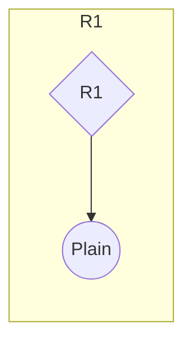

# Cluster internal shapes

## 1. Decisions

| ID | Meaning |
|---|---|
| R1 | A neutral reference |

```mermaid
flowchart LR
  subgraph R1
    A{R1} --> B((Plain))
  end
```

*Figure 1. Cluster internal shapes.*
