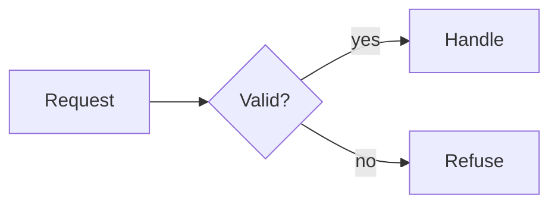
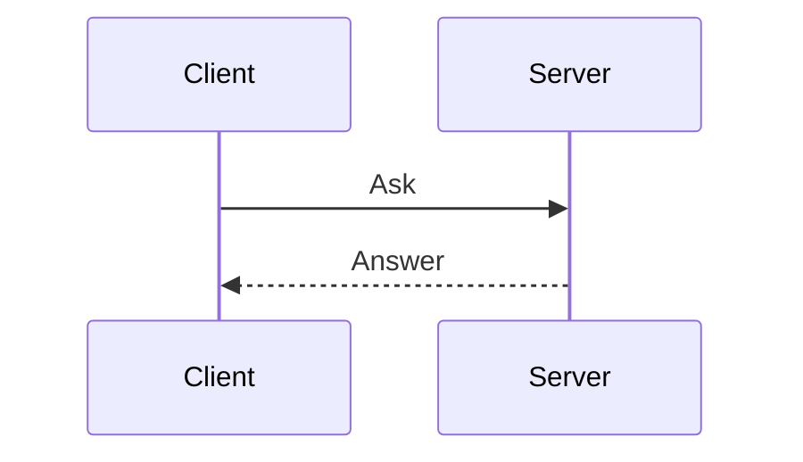

# Diagrams drawn

**Spec** · 2026-10-20 · Status: Draft

A flowchart and a sequence diagram, each drawn on its plate.

## Shapes

```mermaid
flowchart LR
  A[Request] --> B{Valid?}
  B -->|yes| C[Handle]
  B -->|no| D[Refuse]
```

*Figure 1. The flow of one request.*

```mermaid
sequenceDiagram
  Client->>Server: Ask
  Server-->>Client: Answer
```

*Figure 2. One exchange.*
